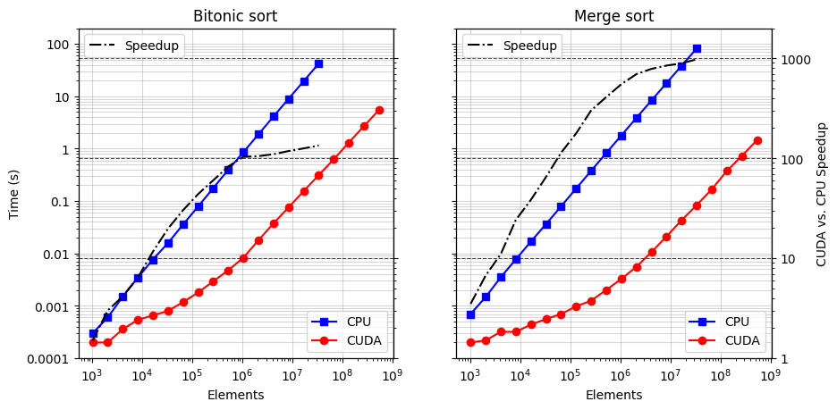

# Parallel_Sorting_CUDA
In this project two sorting algorithms, Bitonic and Merge sort, have been re-implemented in their parallel versions using the CUDA exten- sion for the C programming language.

## Time & Throughput comparison (CUDA vs CPU)
 

