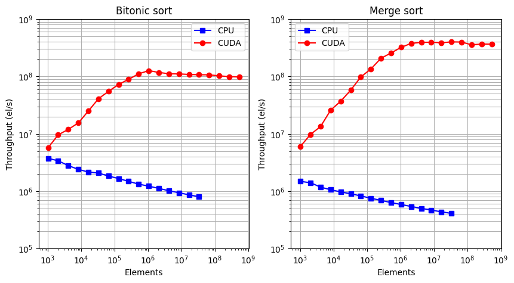

# Parallel_Sorting_CUDA
In this project two sorting algorithms, Bitonic and Merge sort, have been re-implemented in their parallel versions using the CUDA extension for the C programming language.

## Run commands (Windows)
Compile and launch bitonic sort:
```
nvcc bitonic.cu -o bitonic.exe
./bitonic.exe
```

Compile and launch merge sort:
```
nvcc merge.cu -o merge.exe
./merge.exe
```

## Run commands (Linux)
Compile and launch bitonic sort:
```
nvcc bitonic.cu -o bitonic.out
./bitonic.out
```

Compile and launch merge sort:
```
nvcc merge.cu -o merge.out
./merge.out
```

## Time & Throughput comparison (CUDA vs CPU)
  


